**SOC Home Lab: Wazuh SIEM with Custom Detection Rules**

**Overview**

This project documents the setup of a small Security Operations Center (SOC) home lab built with **Wazuh**, an open-source SIEM/XDR platform. The goal was to gain hands-on experience with log collection, security event detection, and writing custom correlation rules mapped to the **MITRE ATT&CK** framework.

**Architecture**

| Component                   | Role                                                   | OS         |
| --------------------------- | ------------------------------------------------------ | ---------- |
| Wazuh Manager (OVA v4.14.7) | SIEM server : manager, indexer, dashboard (all-in-one) | Linux      |
| Windows Agent               | Monitored endpoint                                     | Windows 11 |

All VMs run on Oracle VirtualBox on a local network (192.168.1.0/24)

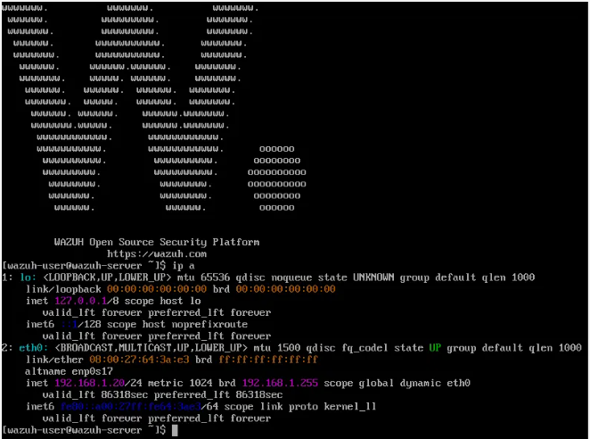

**What Was Built**

- Deployed a Wazuh Manager (official OVA appliance) providing the manager, indexer, and dashboard in one place.
- Enrolled a Windows 11 endpoint as a monitored agent, verified as **Active** in the dashboard.
- Confirmed baseline log collection : authentication events (successful and failed logons) flowing from the endpoint into the SIEM.
- Wrote and validated a custom correlation rule to detect brute-force-style behavior, mapped to MITRE ATT&CK.

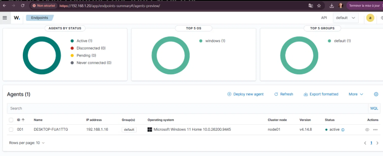

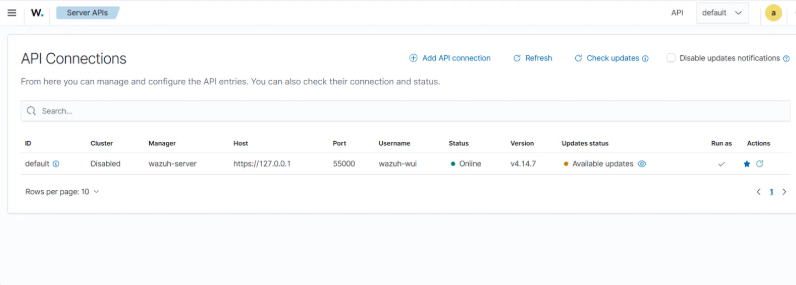

**Custom Detection Rule**

**Goal :** Detect a possible brute-force attempt 5 failed logons from the same agent within 2 minutes.

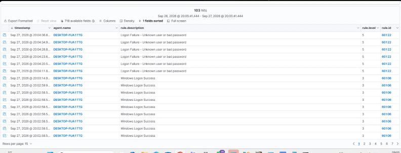

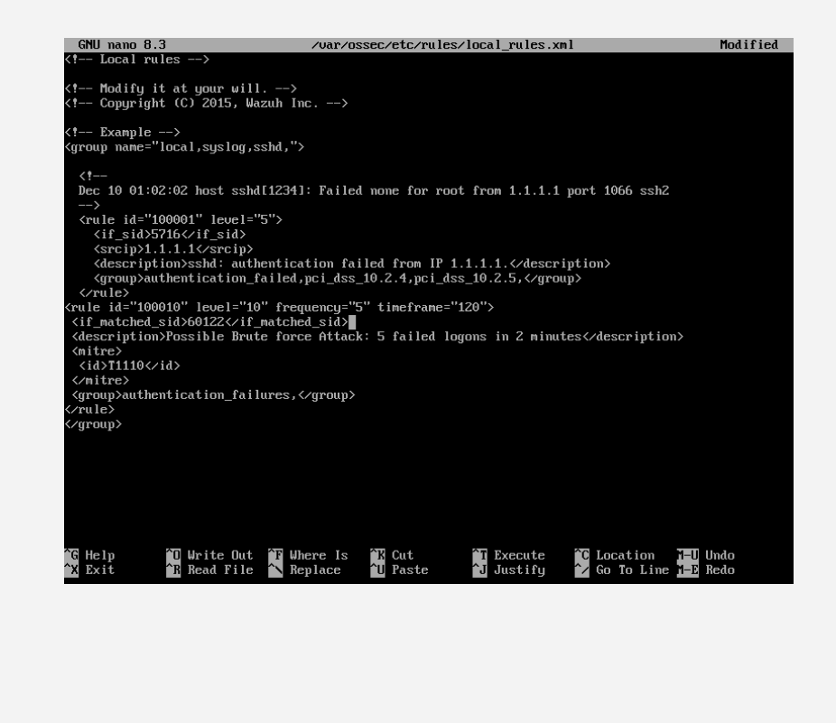

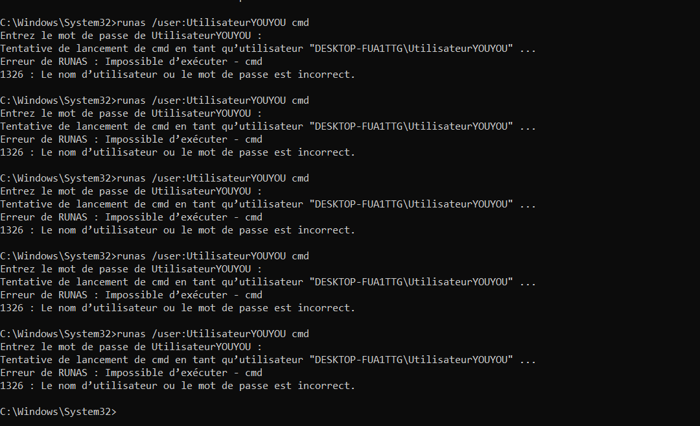

| Field           | Value                                                |
| --------------- | ---------------------------------------------------- |
| Rule ID         | 100010                                               |
| Level           | 10                                                   |
| Base rule       | 60122 (Logon Failure - Unknown user or bad password) |
| MITRE Technique | T1110 - Brute Force                                  |
| MITRE Tactic    | Credential Access                                    |

**Test & Results**

**Procedure:**

1. On the Windows endpoint, simulate failed logon attempts (runas /user:FakeUser cmd, repeated 5 times within 2 minutes).
2. In the dashboard, under Threat Hunting → Events, filter on rule.id : 100010.

**Result :** A single level-10 alert « _Possible Brute force Attack : 5 failed logons in 2 minutes"_ correctly correlated the 5 individual level-5 logon-failure events into one higher-severity detection.

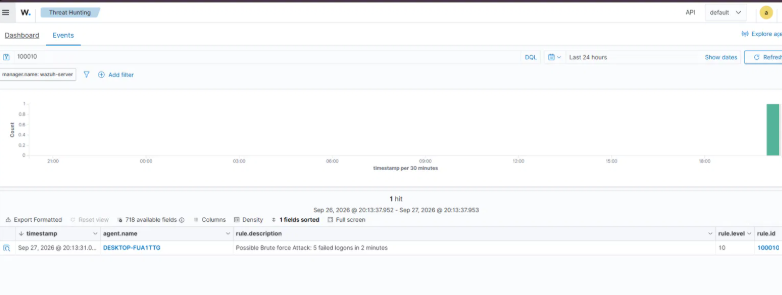

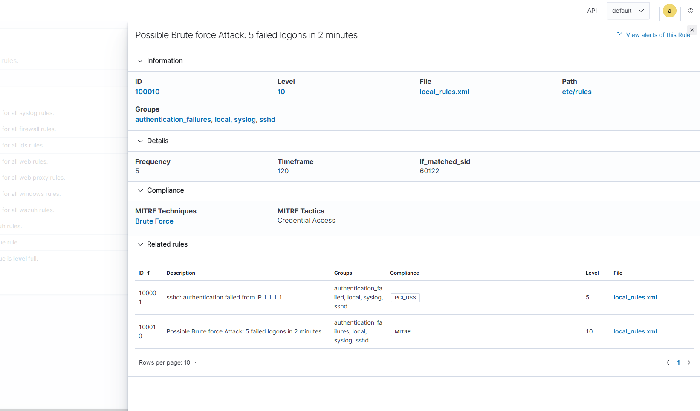

**Network Reconnaissance from Kali**

**Goal :** Evaluate whether Wazuh, as a Host-based Intrusion Detection System (HIDS), reacts to external network scanning activity the way it reacts to host-level events like failed logons.

**Procedure:**

1. Configured Kali Linux with a Bridged network adapter, placing it on the same subnet as the Wazuh Manager and the Windows endpoint.
2. Verified connectivity with ping reachable for the Wazuh Manager, blocked by the Windows Firewall (ICMP) for the Windows endpoint, which is expected default behavior.
3. Ran service/version scans with Nmap against both targets .

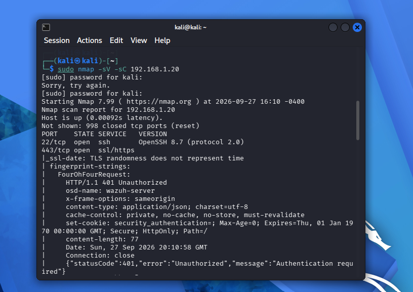

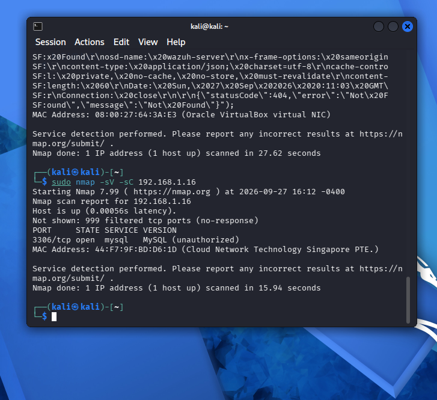

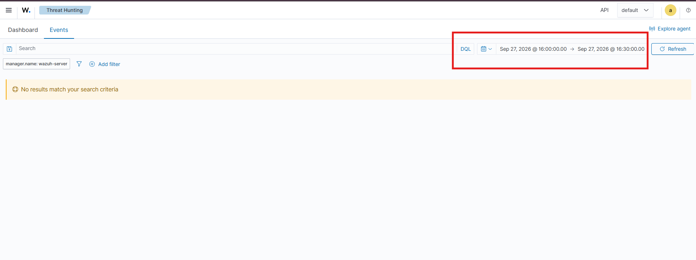

**Result:** The scans revealed open services on both machines including the Wazuh dashboard itself (port 443) and an unexpectedly network-exposed MySQL instance (port 3306, bound to 0.0.0.0) on the Windows endpoint. No alert was generated in Wazuh for either scan.

**Analysis:** This is expected behavior, not a gap in the setup. Wazuh is a **HIDS**: it detects activity that leaves a trace in the monitored host's own logs (authentication attempts, file changes, process activity). A port scan is purely network-level traffic and never touches the host's local logs, so there is nothing for the agent to report. Detecting this kind of reconnaissance would require a **NIDS** (e.g. Suricata or Snort) monitoring network traffic directly a useful complement to a HIDS-only setup, and a good discussion point on defense-in-depth.

**Secondary finding:** The scan also surfaced a real, if minor, hardening opportunity MySQL listening on all interfaces (0.0.0.0:3306) rather than localhost only, discovered via netstat -ano | findstr :3306 on the Windows endpoint. This is a good example of how a simple reconnaissance scan can reveal unintended exposure on a machine.